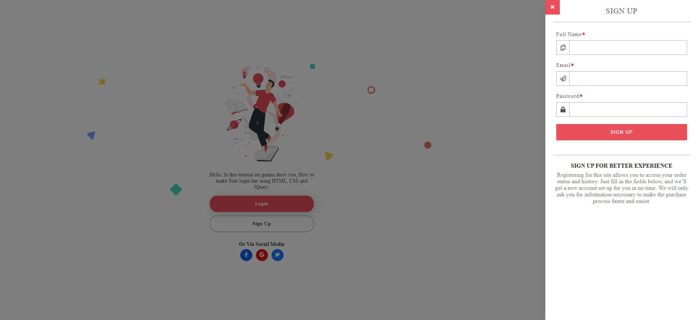

>## Criando uma tela de login lateral e uma barra de formulários de inscrição usando HTML, CSS e jQuery

## Font
Tutorial do canal Going-To Internet
:computer: Link do tutorial: [Click Aqui](https://www.youtube.com/watch?v=dHzcX5em6Ow)

## Resultado abaixo do projeto feito:

  
  
  

